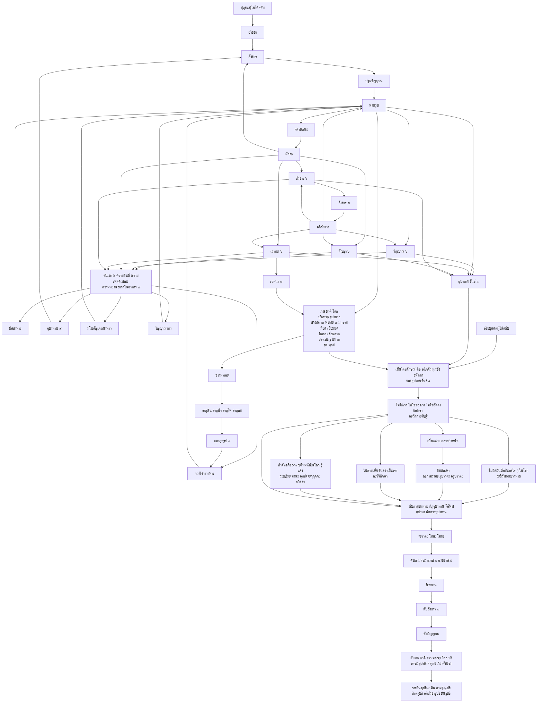

# buddhism
ผู้ใดเห็นปฏิจจสมุปบาท ผู้นั้นเห็นธรรม

```mermaid

flowchart TD
Z0[ปุถุชนผู้ไม่ได้สดับ]-->A[อวิชชา] --> B[สังขาร]
B--> C[ปฐมวิญญาณ ]-->D[นามรูป]-->E[สฬายตนะ]-->F[ผัสสะ]-->G[เวทนา ๖]
F-->H[สัญญา ๖]-->I
I-->F1[ผัสสาหาร]-->D
D-->VI[วิญญาณ ๖]-->P
VI-->I
F-->I
I-->S3
F-->B
G-->I[ตัณหา ๖ ความยินดี ความเพลิดเพลิน \nความทยานอยากในอาหาร ๔]-->J[อุปาทาน ๔]-->B
I-->M1[มโนสัญเจตนาหาร]-->D
I-->V1[วิญญาณหาร]-->D
F-->K[สังขาร ๖]-->I
K-->SK[สังขาร ๓]-->AP[อภิสังขาร]-->D
AP-->G
AP-->H
AP-->VI
AP-->K
D-->P[อุปาทานขันธ์ ๕]
G-->P
H-->P
K-->P
AR[อริยบุคคลผู้ได้สดับ]-->Q
P-->Q[เห็นไตรลักษณ์ คือ อนิจจัง ทุกขัง อนัตตา\nของอุปทานขันธ์ ๕]-->R[ไม่ใช่เรา ไม่ใช่ของเรา ไม่ใช่อัตตาของเรา \nละสักกายทิฏฐิ]
R-->U[ไม่ยึดมั่นถือมั่นอะไร ๆ ในโลก \nละสีลัพพตปรามาส]-->W[ดับกามุปาทาน ทิฏฐุปาทาน สีลัพพตุปาทา อัตตวาทุปาทาน]-->AA[ละราคะ โทสะ โมหะ]-->AB[ดับกามสวะ ภวาสวะ อวิชชาสวะ]-->X[นิพพาน]-->V[ดับสังขาร ๓]-->AD[ดับวิญญาณ]-->AC[ดับภพ ชาติ ชรา มรณะ โสก ปริเทวะ อุปายาส ทุกข์ ภัย ทั้งปวง]-->UP[สละคืนอุปธิ ๔ คือ กามคุณูปธิ กิเลสูปธิ อภิสังขารูปธิ ขันธูปธิ]
R-->S[เบื่อหน่าย คลายกำหนัด]-->T[ดับตัณหา \nละกามราคะ รูปราคะ อรูปราคะ]
T-->W
R-->Y[ไม่ตามเห็นขันธ์ว่าเป็นเรา \nละวิจิกิจฉา]-->W
R-->Z[กำจัดอภิชฌาและโทมนัสในโลก รู้แจ้ง\nละปฏิฆะ มานะ อุทธัจจะกุกุจจะ อวิชชา]-->W
R-->W
S1[ธาตุดิน ธาตุน้ำ ธาตุไฟ ธาตุลม]-->S2[มหาภูตรูป ๔]-->S3[กวฬิงการาหาร]-->D-->D1[ภพ ชาติ โสก \nปริเทวะ อุปายาส \nพร้ดพราก พบภัย ตามกรรม\nมียศ เสื่อมยศ\nมีลาภ เสื่อมลาภ\nสรรเสริญ นินทา\nสุข ทุกข์]-->D0[ชรามรณะ]-->S1
D1-->Q
G-->V3[เวทนา ๓]-->D1
```
