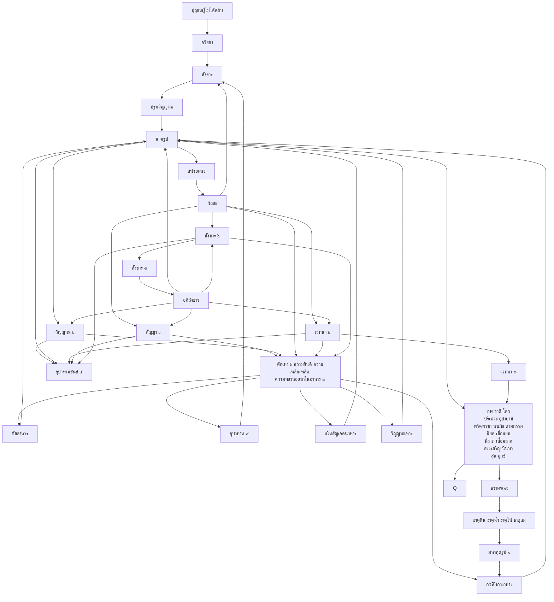

# buddhism
- เราตั้งคบเพลิงคือธรรมไว้สำหรับชนภายหลังได้ตรัสรู้ ฯ ([ขุททกนิกาย อปทาน ภาค ๒](https://84000.org/tipitaka/pitaka_item/r.php?B=33&A=8554&w=%E0%B8%95%E0%B8%B1%E0%B9%89%E0%B8%87%E0%B8%84%E0%B8%9A%E0%B9%80%E0%B8%9E%E0%B8%A5%E0%B8%B4%E0%B8%87%E0%B8%84%E0%B8%B7%E0%B8%AD%E0%B8%98%E0%B8%A3%E0%B8%A3%E0%B8%A1%E0%B9%84%E0%B8%A7%E0%B9%89%E0%B8%AA%E0%B8%B3%E0%B8%AB%E0%B8%A3%E0%B8%B1%E0%B8%9A%E0%B9%83%E0%B8%AB%E0%B9%89%E0%B8%84%E0%B8%99%E0%B8%A0%E0%B8%B2%E0%B8%A2%E0%B8%AB%E0%B8%A5%E0%B8%B1%E0%B8%87%E0%B9%84%E0%B8%94%E0%B9%89%E0%B8%95%E0%B8%A3%E0%B8%B1%E0%B8%AA%E0%B8%A3%E0%B8%B9%E0%B9%89))
- ผู้ใดเห็น[ปฏิจจสมุปบาท](https://kietpawpan.github.io/buddism/truth.html) ผู้นั้นเห็นธรรม ฯ ([มัชฌิมนิกาย มูลปัณณาสก์](https://84000.org/tipitaka/pitaka_item/r.php?B=12&A=6265&w=%E0%B8%9C%E0%B8%B9%E0%B9%89%E0%B9%83%E0%B8%94%E0%B9%80%E0%B8%AB%E0%B9%87%E0%B8%99%E0%B8%9B%E0%B8%8F%E0%B8%B4%E0%B8%88%E0%B8%88%E0%B8%AA%E0%B8%A1%E0%B8%B8%E0%B8%9B%E0%B8%9A%E0%B8%B2%E0%B8%97%20%E0%B8%9C%E0%B8%B9%E0%B9%89%E0%B8%99%E0%B8%B1%E0%B9%89%E0%B8%99%E0%B8%8A%E0%B8%B7%E0%B9%88%E0%B8%AD%20%E0%B8%A7%E0%B9%88%E0%B8%B2%E0%B9%80%E0%B8%AB%E0%B9%87%E0%B8%99%E0%B8%98%E0%B8%A3%E0%B8%A3%E0%B8%A1))
- เมื่อเห็นธรรมย่อมชื่อว่าเห็นเรา ฯ ([ขุททกนิกาย ขุททกปาฐะ-ธรรมบท-อุทาน-อิติวุตตกะ-สุตตนิบาต](https://84000.org/tipitaka/pitaka_item/r.php?B=25&A=6335&w=%E0%B9%80%E0%B8%A1%E0%B8%B7%E0%B9%88%E0%B8%AD%E0%B9%80%E0%B8%AB%E0%B9%87%E0%B8%99%E0%B8%98%E0%B8%A3%E0%B8%A3%E0%B8%A1%E0%B8%A2%E0%B9%88%E0%B8%AD%E0%B8%A1%E0%B8%8A%E0%B8%B7%E0%B9%88%E0%B8%AD%E0%B8%A7%E0%B9%88%E0%B8%B2%E0%B9%80%E0%B8%AB%E0%B9%87%E0%B8%99%E0%B9%80%E0%B8%A3%E0%B8%B2))
- ผู้ไม่เห็นสัทธรรมถึงจะเห็นเราก็ชื่อว่าไม่เห็น ฯ ([ขุททกนิกาย อปทาน ภาค ๒ -พุทธวังสะ-จริยาปิฎก](https://84000.org/tipitaka/pitaka_item/r.php?B=33&A=2822&w=%E0%B8%9C%E0%B8%B9%E0%B9%89%E0%B9%84%E0%B8%A1%E0%B9%88%E0%B9%80%E0%B8%AB%E0%B9%87%E0%B8%99%E0%B8%AA%E0%B8%B1%E0%B8%97%E0%B8%98%E0%B8%A3%E0%B8%A3%E0%B8%A1%E0%B8%96%E0%B8%B6%E0%B8%87%E0%B8%88%E0%B8%B0%E0%B9%80%E0%B8%AB%E0%B9%87%E0%B8%99%E0%B9%80%E0%B8%A3%E0%B8%B2%E0%B8%81%E0%B9%87%E0%B8%8A%E0%B8%B7%E0%B9%88%E0%B8%AD%E0%B8%A7%E0%B9%88%E0%B8%B2%E0%B9%84%E0%B8%A1%E0%B9%88%E0%B9%80%E0%B8%AB%E0%B9%87%E0%B8%99))



```mermaid
AR[อริยบุคคลผู้ได้สดับ]-->Q
P[อุปาทานขันธ์ ๕]-->Q[เห็นไตรลักษณ์ คือ อนิจจัง ทุกขัง อนัตตา\nของอุปทานขันธ์ ๕]-->R[ไม่ใช่เรา ไม่ใช่ของเรา ไม่ใช่อัตตาของเรา \nละสักกายทิฏฐิ]
R-->U[ไม่ยึดมั่นถือมั่นอะไร ๆ ในโลก \nละสีลัพพตปรามาส]-->W[ดับกามุปาทาน ทิฏฐุปาทาน สีลัพพตุปาทา อัตตวาทุปาทาน]-->AA[ละราคะ โทสะ โมหะ]-->AB[ดับกามสวะ ภวาสวะ อวิชชาสวะ]-->X[นิพพาน]-->V[ดับสังขาร ๓]-->AD[ดับวิญญาณ]-->AC[ดับภพ ชาติ ชรา มรณะ โสก ปริเทวะ อุปายาส ทุกข์ ภัย ทั้งปวง]-->UP[สละคืนอุปธิ ๔ คือ กามคุณูปธิ กิเลสูปธิ อภิสังขารูปธิ ขันธูปธิ]
R-->S[เบื่อหน่าย คลายกำหนัด]-->T[ดับตัณหา \nละกามราคะ รูปราคะ อรูปราคะ]
T-->W
R-->Y[ไม่ตามเห็นขันธ์ว่าเป็นเรา \nละวิจิกิจฉา]-->W
R-->Z[กำจัดอภิชฌาและโทมนัสในโลก รู้แจ้ง\nละปฏิฆะ มานะ อุทธัจจะกุกุจจะ อวิชชา]-->W
R-->W
```
